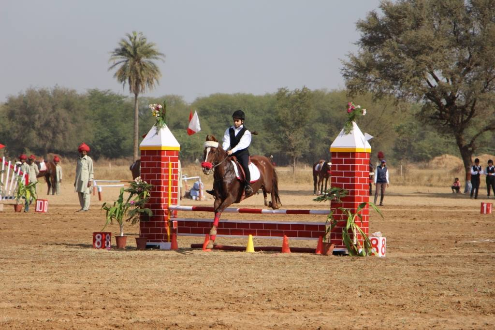
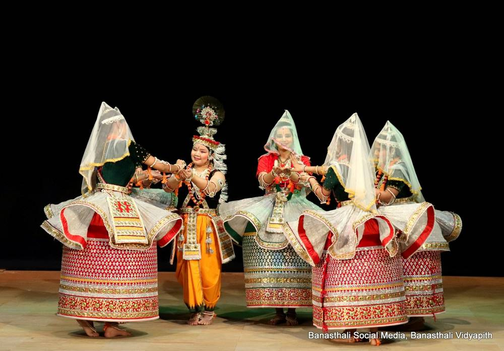
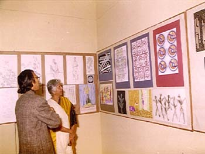
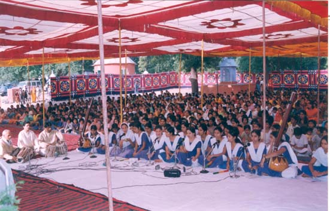
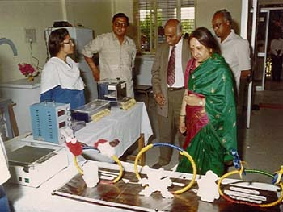

# *Five Fold Education (Panchmukhi Shiksha)*
Banasthali Vidyapith aims at the synthesis of spiritual value of the East and scientific spirit of the West. The main thrust of all the activities of the Banasthali Vidyapith is the development of a complete personality. The institution firmly believes that the personality consists of interdependent components, each being equally important requiring equal attention and can only be developed through a wholesome education. The ‘Panchmukhi Shiksha’  which has evolved from experimentation, attempts a balance among the  five necessary aspects of education: Physical, Practical, Aesthetic, Moral and Intellectual.

## ** Physical:**
Under physical education programme, various activities like parade , shooting, riding, flying, girl guiding, bulbul, swimming, yoga and various modern and traditional sports like kabbadi, kho-kho, hockey, basket ball, badminton, long jump, high jump etc . are included. Students who have opted for a physical activity under the Five Fold Education programme compulsorily take a Fitness Assessment test.

 ## ** Aesthetic:**
 Students learn  music and  painting up to class v,. They can choose either music (vocal or instrumental) or painting. Dance education is being provided to  the students  of all levels.

## ** Practical : **
Under practical education sanganary printing & dying, batique, bandhej, tailoring, embroidery, craft, papermache etc. are included. Under domestic education, students are supposed to perform cleaning and washing and collective Shramadan.

## ** Moral : **
The aim of moral education is to develop personality of the students, so as to cultivate in them the feeling of respect for all religions. It is achieved by the means of weekly prayers, talks, Veda, Geeta & Ramayana path etc. The common evening prayer and Udbodhen program is unique.

## ** Intellectual : **
Intellectual education is being given to the students in order to avoid the relative aspects of modern education. Natural and social sciences with languages and Maths are being taught with sciences from the beginning . Education methods are adopted with the help of projects related to social and natural environment. Banasthali Vidyapith never believes in examination-based education system. It gives emphasis on practical education.

